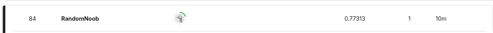

# How to Run

First, you need to run the following:

```sh
git clone https://github.com/cssi87m/AssignmentSemanticSegmentation.git
cd AssignmentSemanticSegmentation
python infer.py --image_path {path_to_image}
or
python3 infer.py --image_path {path_to_image}
```

the result will be shown in  ```{path_to_image}_result.jpeg```

# Competition
https://www.kaggle.com/competitions/bkai-igh-neopolyp/leaderboard

<p align="center">
  
  
</p>